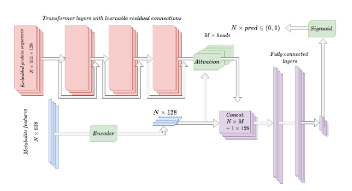

# Self- and cross-attention for the prediction of metabolite-protein interactions



The data and trained models can be downloaded from:

https://drive.google.com/file/d/1Gqr5mpqspvbM3o2JC0Y-iYPZqc6u1A_b/view?usp=sharing

After downloading the file has to be extracted on the app root folder

## Prediction using the trained model

A csv file is passed as argument to the --data flag:

``` bash
python scampi-predict.py --data /mnt/data/sample_interactions.csv
```

It can be build on docker using the included dockerfile:

build image
```bash
docker  build -t scampi:latest .

```
Run the container with a mounted volume entering an interactive session
```bash
docker run -v -it interactions:/mnt/data scampi
```
It will enter a bash session on the container

```bash
docker cp {options} SRC_PATH scampi:mnt/data
```

e.g.
```bash
docker cp sample_interactions.csv scampi:mnt/data
```

From the bash container run the script passing the csv file to the --data argument

```bash
python scampi-predict.py --data /mnt/data/sample_interactions.csv
```
Copy the results to the host from the host session
```bash
docker cp {options} CONTAINER:SRC_PATH DEST_PATH
```
e.g.

```bash
docker cp scampi:mnt/data/sample_interactions_preds.csv .
```
Stop (and remove) the container
```bash
docker container stop scampi && docker container rm scampi
```

## Training of the model
(warning: it requires huge amounts of ram and time, depending on the configuration!):

``` bash
python scampi-train.py
```
